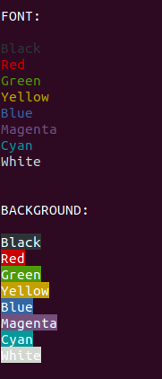
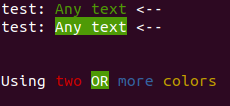

# Bumburum #
Changing the color of text in the console is very easy, especially if you use colors-lite



## Install ##

```bash
npm i bumburum
```

## Usage ##

**JavaScript**
```js
const colors = require('bumburum');

// font color
console.log(`test: ${colors.font.Green}`,  `Any text`);

// background color
console.log(`test: ${colors.background.Green}`, `Any text`);

// two or more colors
console.log(
    `Using ${colors.font.Red} ${colors.background.Green} ${colors.font.Blue} ${colors.font.Yellow}`,

    'two',
    'OR',
    'more',
    'colors'
);

``` 
**TypeScript**
```js
import * as colors from 'bumburum';


console.log(`test: ${colors.font.Green}`,  `Any text`);
console.log(`test: ${colors.background.Green}`, `Any text`);

``` 

Result: 

## Colors support ##

### Font ###
    colors.font.Black,
    colors.font.Red,
    colors.font.Green,
    colors.font.Yellow,
    colors.font.Blue,
    colors.font.Magenta,
    colors.font.Cyan,
    colors.font.White,

###  Background ###
    colors.background.Black,
    colors.background.Red,
    colors.background.Green,
    colors.background.Yellow,
    colors.background.Blue,
    colors.background.Magenta,
    colors.background.Cyan,
    colors.background.White,
